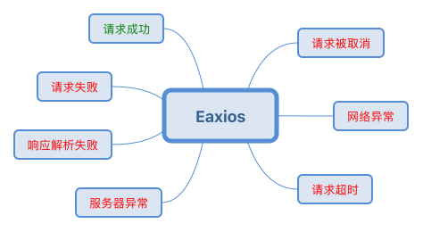

> axios 现有版本已经内置了错误码，开发者在它基础上自定义拦截器即可满足需求。

Eaxios 是基于 [axios](https://github.com/axios/axios) 封装的网络请求库，在保持 API 与 axios 基本一致的情况下，简化服务端响应内容和各种异常情况的处理。

## 开发背景



如上图所示，是一次 Ajax 请求可能输出的结果，在前端我们需要根据输出结果给用户不同的提示。

- 请求被取消：忽略
- 网络异常：提示检查是否连接网络
- 请求超时：提示网络慢，请切换网络
- 服务器异常：提示系统出问题了
- 响应解析失败：同上，且可以进行错误日志上报
- 请求失败：这种情况通常是业务异常，前端需要根据错误码进行相应的处理，最简单的就是消息提醒
- 请求成功：前端拿到数据后更新界面

但是，现有的 Axios 库对于异常结果没有提供较好的封装，Axios Promise catch 里包含各种类型的错误，而且没有提供错误码来识别请求失败的原因。而且很多服务端接口会返回自己的错误码，这样在 Axios Promise then 里也需要处理业务异常。

此外，Axios 本身如下所述的一些问题和局限性。

- 如果设置 Axios responseType 为 json 时，服务端返回的非 JSON 格式的响应内容会因为无法解析，response.data 为 null

    对于 500 等错误，响应内容会丢失，所以不要去配置 responseType 为 json，对于使用者来说容易采到这个坑。
    
    ps：虽然 Axios 官方文档声明 responseType 是 json，实际上底层调用 XMLHttpRequest 的 responseType 是没有传值的，应该是为了规避这个问题。

- Axios 默认不管 HTTP 响应状态和 responseType 是什么，都会调用默认的 [transformResponse](https://github.com/axios/axios/blob/b7e954eba3911874575ed241ec2ec38ff8af21bb/lib/defaults.js#L57)

    ps：应该是为了规避上一个问题，默认提供了一个响应处理函数进行 JSON 解析，但是这会影响性能（500 等响应内容值较多时，会造成页面卡顿）。虽然 transformResponse 可以转换 response，实际接收到的参数是 response.data，所以无法判断具体情况来决定是否进行解析 JSON。

- Axios then 和 catch 是根据 [validateStatus](https://github.com/axios/axios#request-config) 决定的，使用者处理以来较为麻烦。

    理想情况下，使用者希望 then 返回有效的数据，catch 返回各种错误情况：请求被取消、网络异常、网络超时、服务端异常、服务端数据格式错误、业务异常。

- Axios 默认不处理 `content-type` 为 `application/x-www-form-urlencoded` 类型的请求体，使用起来不够方便

优化方案： 

- 如果设置 Axios responseType 为 json 时，不要传给传 XMLHttpRequest，以避免非 JSON 格式的响应内容丢失
- Axios 根据响应头的 content-type 判断是否需要解析 JSON，以避免性能问题

    通过请求拦截器实现不给 Axios 传递 transformResponse 配置，且将配置备份到其他字段上，然后在响应拦截器中将响应对象 response 传递给 transformResponse 处理。响应拦截器根据 response 提供的状态码、响应头和响应内容判断是否要进行 JSON 转换。

- 取消 Axios validateStatus 的配置选项，默认所有大于 0 的状态码都是正确的状态码，然后在 Axios 拦截器 then 中进行数据解析（非 200 的可能也是 JSON，所以要复用 200 的 JSON 解析代码），并且根据异常情况抛出直观的错误对象
- 内置默认处理表单类型的请求体

## 用法说明

eaxios 主要对响应的处理做了一些优化，除了以下部分，eaxios 的 api 与 axios 保持一致：

- eaxios 请求配置的 transformResponse 传参和处理时机发生了变化

    axios 在服务端响应内容后就会调用 transformResponse 进行响应转换，eaxios 响应后内部自动根据响应头和 responseType 进行 JSON 解析，然后将解析后的数据和 response 传给 transformResponse，transformResponse 返回的数据最终会被 Promise resovle 给外部调用者。

    假设服务端返回的数据结构为 `{ code: 0, message: 'success', data: {} }`，code 为 0 表示正确的响应，非 0 表示异常，接口请求的代码示例如下所示：

    ```js
    const eaxios = require('eaxios');

    eaxios.defaults.transformResponse = [
      function (data, response) {
        if (typeof data === 'object') {
          // 默认约定有成功解析 JSON 对象，就认为服务端成功响应，且有提供错误码
          if (data.code === 0) {
            return data.data;
          } else {
            throw eaxios.createError(data.message, data.code, response);
          }
        } else {
          // 50x 等服务异常情况
          throw eaxios.createError(
            data,
            response.config.responseError.SERVER_ERROR,
            response
          );
        }
      },
    ];

    return eaxios('https://run.mocky.io/v3/4f503449-0349-467e-a38a-c804956712b7')
      .then((data) => {
        console.log('success', data.id);
      })
      .catch((error) => {
        console.log('failure', error.code); // UNKNOWN、REQUEST_OFFLINE、REQUEST_TIMEOUT、SERVER_ERROR、RESPONSE_INVALID 和业务错误码
      });
    ```

    ps：如果存在服务单接口请求规范，可以通过 eaxios.create 创建适用于不同接口规范的请求函数。

- eaxios 的请求处理函数 then 只会接收到 transformResponse 转换后的数据，对于网络、超时、服务端异常和业务异常等问题，会在 catch 接收一个 EaxiosError 类型的错误对象。

    ```ts
    interface EaxiosError<T = any> extends Error {
      config: EaxiosRequestConfig;
      code?: string;
      request?: any;
      response?: EaxiosResponse<T>;
      isAxiosError: boolean;
      toJSON: () => object;
    }
    ```

    错误处理函数可以根据错误码 code 来处理异常，code 可能的值为 UNKNOWN、REQUEST_OFFLINE、REQUEST_TIMEOUT、SERVER_ERROR、RESPONSE_INVALID 和其他业务错误码。

    ps：如果要定制错误码，可以在请求配置中添加配置项 `responseError`。

    ```js
    eaxios.defaults.responseError = {
      REQUEST_OFFLINE: '1'REQUEST_OFFLINE
    };
    ```

- eaxios 内部会自动序列化表单类型的请求参数，所以主要传对象给 data 就行了。

## 代码示例

下面以 `{ code: 0, message: 'success', data: { } }` 这样的接口规范为例，演示如何使用 eaxios。

```js
const eaxios = require('..');

const request = eaxios.create({
  baseURL: 'https://run.mocky.io/v3',
  timeout: 30000,
  transformResponse: [
    function (data, response) {
      if (typeof data === 'object') {
        if (data.code === 0) {
          return data.data;
        } else {
          throw eaxios.createError(data.message, data.code, response);
        }
      } else {
        throw eaxios.createError(
          data,
          response.config.responseError.SERVER_ERROR,
          response,
        );
      }
    },
  ],
});

function printError(error) {
  console.log(
    `code: ${error.code}, name: ${error.name}, message: ${error.message}, isAxiosError: ${error.isAxiosError}, stack:\n${error.stack}`,
  );
}

function success() {
  console.log('>> success');
  return request('/4f503449-0349-467e-a38a-c804956712b7')
    .then((data) => {
      console.log('success', data);
    })
    .catch((error) => {
      printError(error);
    });
}

function failure() {
  console.log('>> failure');
  return request('/42d7c21d-5ae6-4b52-9c2d-4c3dd221eba4')
    .then((data) => {
      console.log('success', data);
    })
    .catch((error) => {
      printError(error);
    });
}

function invalid() {
  console.log('>> invalid');
  return request('/1b23549f-c918-4362-9ac8-35bc275c09f0')
    .then((data) => {
      console.log('success', data);
    })
    .catch((error) => {
      printError(error);
    });
}

function server_500() {
  console.log('>> server_500');
  return request('/2a9d8c00-9688-4d36-b2de-2dee5e81f5b3')
    .then((data) => {
      console.log('success', data);
    })
    .catch((error) => {
      printError(error);
    });
}

success().then(failure).then(invalid).then(server_500);
/* log
>> success
success { id: 1 }
>> failure
code: 10000, name: Error, message: error, isAxiosError: true, stack: ...
>> invalid
code: RESPONSE_INVALID, name: SyntaxError, message: Unexpected token V in JSON at position 0, isAxiosError: true, stack: ...
>> server_500
code: SERVER_ERROR, name: Error, message: ...,  stack: ...
*/
```

## 兼容性

eaxios 依赖 URLSearchParams 处理表单类型的请求参数，不支持的环境需要引入响应的 polyfill

- [core-js](https://github.com/zloirock/core-js)

    ```js
    require("core-js/modules/web.url-search-params.js")
    ```

- [url-search-params-polyfill](https://www.npmjs.com/package/url-search-params-polyfill)
